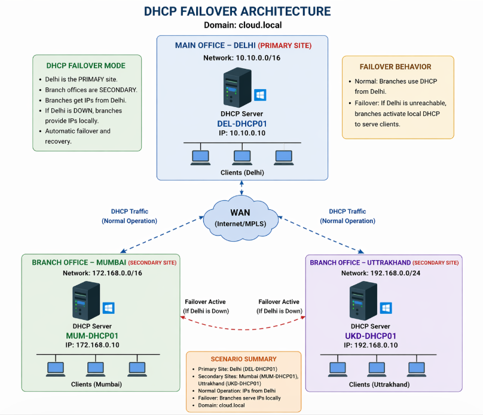

# windowsserver-dhcp-failover-cluster
Enterprise DHCP Failover Lab across multi-site infrastructure (Delhi, Mumbai, Uttarakhand) using Windows Server and PowerShell automation with Hot Standby configuration.
# 🚀 DHCP Failover Multi-Site Lab (cloud.local)

## 📌 Project Overview

This project demonstrates a **real-world enterprise DHCP Failover setup** across multiple sites using Windows Server and PowerShell automation.

The infrastructure simulates:

* 🏢 Main Office (Delhi - Primary Site)
* 🌆 Branch Office (Mumbai - Secondary Site)
* 🏔️ Branch Office (Uttarakhand - Secondary Site)

The goal is to ensure **high availability of IP address allocation** using DHCP Failover in **Hot Standby mode**.

---
## 🏗️ Architecture Diagram

## 🏗️ Architecture Design

* Domain: `cloud.local`
* Failover Type: **Hot Standby**
* Primary Server: Delhi
* Secondary Servers: Mumbai & Uttarakhand

### 🖥️ Server Details

| Site        | Server Name | IP Address   | Role           |
| ----------- | ----------- | ------------ | -------------- |
| Delhi       | DEL-DHCP01  | 10.10.0.10   | Primary DHCP   |
| Mumbai      | MUM-DHCP01  | 172.168.0.10 | Secondary DHCP |
| Uttarakhand | UKD-DHCP01  | 192.168.0.10 | Secondary DHCP |

---

## 🌐 Network Configuration

| Location    | Network Range  |
| ----------- | -------------- |
| Delhi       | 10.10.0.0/16   |
| Mumbai      | 172.168.0.0/16 |
| Uttarakhand | 192.168.0.0/24 |

---

## ⚙️ Key Features

* ✅ DHCP Role Installation via PowerShell
* ✅ Active Directory Integration
* ✅ Scope Creation for Multiple Sites
* ✅ DHCP Failover Configuration
* ✅ Hot Standby Mode Implementation
* ✅ Automatic Failover & Recovery
* ✅ End-to-End Testing

---

## 🔁 Failover Behavior

### 🟢 Normal Operation

* All clients receive IP addresses from **Delhi (Primary Server)**

### 🔴 Failure Scenario

* If Delhi is down:

  * Mumbai clients → served by **MUM-DHCP01**
  * Uttarakhand clients → served by **UKD-DHCP01**

---

## 🧠 Important Concept

⚠️ DHCP Failover supports **only 2 servers per relationship**

This project uses:

* Delhi ↔ Mumbai (Failover Pair)
* Delhi ↔ Uttarakhand (Failover Pair)

---

## 🛠️ Technologies Used

* Windows Server 2019 / 2022
* Active Directory Domain Services (AD DS)
* DHCP Server Role
* PowerShell Automation
* Networking Concepts (IPAM, Subnetting)

---

## 🧪 Testing Scenarios

### ✔️ Test 1 – Normal Operation

* Clients receive IP from Delhi

### ✔️ Test 2 – Failover

* Stop DHCP service on Delhi
* Clients automatically get IP from branch servers

### ✔️ Test 3 – Recovery

* Restart DHCP on Delhi
* Failover relationship restores

---

## 🔌 Prerequisites

* Domain configured (`cloud.local`)
* Network connectivity between sites (VPN/MPLS)
* DHCP servers authorized in AD
* Router configured with **IP Helper (DHCP Relay)**

---

## 📜 PowerShell Automation

All configurations are automated using PowerShell:

* DHCP Role Installation
* Scope Creation
* Failover Setup
* Verification

---

## 👨‍💻 Author

**Virender Singh Rawat**
Cloud Architect

---

